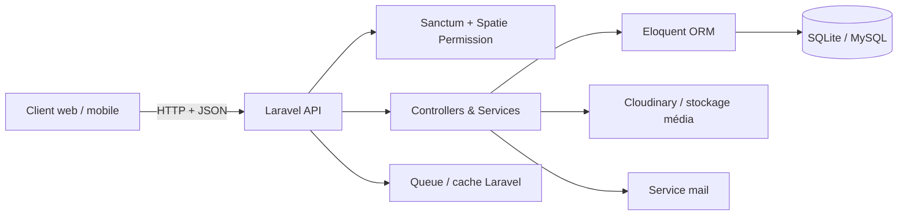
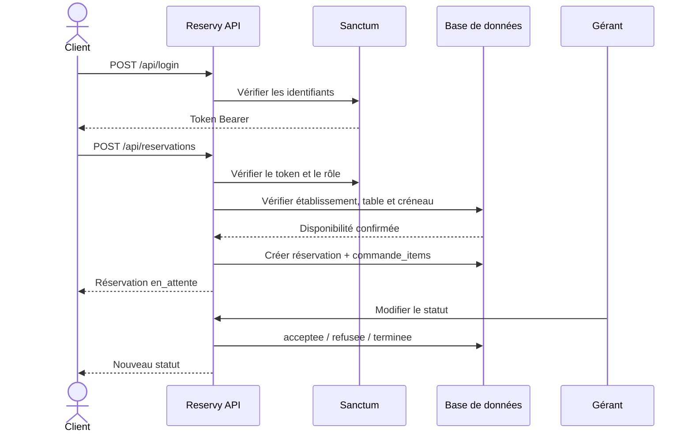
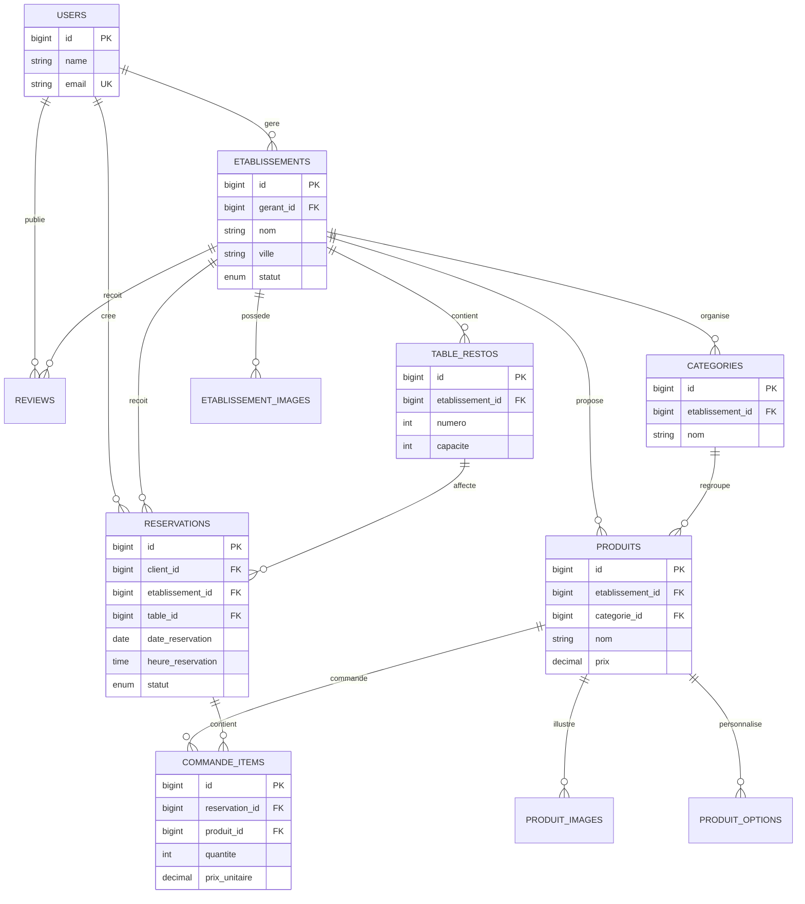

<div align="center">

# Reservy Backend

### API REST de réservation pour cafés et restaurants


**Reservy** centralise la découverte des établissements, la réservation de tables et la pré-commande de produits.

</div>

---

## Sommaire

- [À propos](#-à-propos)
- [Fonctionnalités](#-fonctionnalités)
- [Architecture](#-architecture)
- [Modèle de données](#-modèle-de-données)
- [Prérequis](#-prérequis)
- [Installation locale](#-installation-locale)
- [Docker](#-docker)
- [Configuration](#-configuration)
- [API](#-api)
- [Authentification et rôles](#-authentification-et-rôles)
- [Tests et qualité](#-tests-et-qualité)
- [Structure du projet](#-structure-du-projet)
- [Dépôts liés](#-dépôts-liés)

## À propos

Reservy répond à deux besoins :

- **Clients :** rechercher un café ou un restaurant, consulter son menu, réserver une table et pré-commander des produits.
- **Gérants :** administrer leur établissement, leurs tables, leurs catégories et leurs produits.
- **Administrateurs :** modérer les établissements et disposer d'une vue globale sur la plateforme.

Ce dépôt contient uniquement le backend HTTP. Il expose une API Laravel consommable par une application web ou mobile.

## Fonctionnalités

### Comptes et sécurité

- Inscription, connexion et déconnexion.
- Connexion avec Google via Socialite.
- Réinitialisation du mot de passe.
- Authentification par tokens avec Laravel Sanctum.
- Autorisation par rôles avec Spatie Laravel Permission.

### Établissements

- Création et modification d'un établissement.
- Validation ou refus par un administrateur.
- Gestion des images et des tables.
- Recherche et consultation publiques.

### Menus

- Catégories de produits.
- Produits avec description et prix.
- Images principales et secondaires.
- Options avec prix supplémentaire.

### Réservations

- Création et gestion des réservations.
- Date, heure, nombre de personnes et table.
- Pré-commandes liées à une réservation.
- Statuts de réservation et de paiement.

### Avis

- Modèle de données pour les avis clients (note et commentaire).
- Les routes dédiées aux avis pourront être ajoutées dans une prochaine version.

## Architecture



### Flux d'une réservation



## Modèle de données



## Prérequis

- PHP **8.2+**
- Composer 2
- SQLite (configuration par défaut) ou MySQL 8+
- PHP extensions : `pdo`, `pdo_sqlite` ou `pdo_mysql`, `mbstring`, `openssl`, `xml`, `ctype`, `json`, `fileinfo`
- Node.js et npm uniquement si les assets Vite doivent être compilés

## Installation locale

```bash
git clone https://github.com/AITABBOUyoussef/reservy-backend.git
cd reservy-backend
composer install
copy .env.example .env       # Windows
# cp .env.example .env       # Linux / macOS
php artisan key:generate
php artisan migrate --seed
php artisan serve
```

L'API est alors disponible sur `http://localhost:8000/api`.

### Configuration SQLite (par défaut)

Le fichier `database/database.sqlite` est déjà prévu par la configuration du projet. Vérifiez que les variables suivantes sont présentes dans `.env` :

```env
DB_CONNECTION=sqlite
DB_DATABASE=database/database.sqlite
```

### Configuration MySQL

```env
DB_CONNECTION=mysql
DB_HOST=127.0.0.1
DB_PORT=3306
DB_DATABASE=reservy
DB_USERNAME=root
DB_PASSWORD=
```

Puis exécutez :

```bash
php artisan config:clear
php artisan migrate --seed
```

## Docker

Le `Dockerfile` fourni utilise PHP 8.3 avec Apache et sert Laravel depuis le dossier `public/`.

```bash
docker build -t reservy-backend .
docker run --rm -p 8000:8000 --env-file .env reservy-backend
```

> Pour un déploiement Docker, configurez une base MySQL/PostgreSQL accessible depuis le conteneur et définissez `PORT` selon la plateforme cible.

## Configuration

Copiez `.env.example` vers `.env` et adaptez au minimum :

| Variable | Description |
|---|---|
| `APP_URL` | URL publique de l'API |
| `APP_KEY` | Clé Laravel générée par `php artisan key:generate` |
| `DB_*` | Connexion à la base de données |
| `FILESYSTEM_DISK` | Disque de stockage des fichiers |
| `MAIL_*` | Transport utilisé pour les e-mails de réinitialisation |
| `GOOGLE_CLIENT_ID` / `GOOGLE_CLIENT_SECRET` | Identifiants OAuth Google, si activé |
| `CLOUDINARY_*` | Paramètres Cloudinary, si l'upload média distant est activé |

Ne commitez jamais le fichier `.env` ni des clés privées.

## API

Toutes les routes sont préfixées par `/api`. Les routes protégées exigent :

```http
Authorization: Bearer ${ACCESS_TOKEN}
Accept: application/json
```

### Authentification

| Méthode | Endpoint | Accès | Description |
|---|---|---|---|
| `POST` | `/login` | Public | Connexion |
| `POST` | `/Register` | Public | Inscription |
| `POST` | `/auth/google` | Public | Connexion Google |
| `POST` | `/forgot-password` | Public | Demander un lien de réinitialisation |
| `POST` | `/reset-password` | Public | Réinitialiser le mot de passe |
| `POST` | `/logout` | Authentifié | Révoquer le token courant |
| `POST` | `/editProfil` | Authentifié | Modifier le profil |
| `POST` | `/destroy` | Authentifié | Supprimer le compte |

### Découverte

| Méthode | Endpoint | Accès | Description |
|---|---|---|---|
| `GET` | `/GetEtablissement` | Public | Lister/rechercher les établissements |
| `POST` | `/GetEtablissementDet` | Public | Consulter le détail d'un établissement |

### Réservations

| Méthode | Endpoint | Accès | Description |
|---|---|---|---|
| `GET` | `/reservations` | Authentifié | Lister les réservations accessibles |
| `POST` | `/reservations` | Authentifié | Créer une réservation |
| `GET` | `/reservations/{id}` | Authentifié | Consulter une réservation |
| `PUT/PATCH` | `/reservations/{id}` | Authentifié | Modifier une réservation |
| `DELETE` | `/reservations/{id}` | Authentifié | Supprimer une réservation |

### Commande

Une commande est ajoutée séparément après la création de la réservation.
La valeur de `reservation_id` est l'`id` retourné par `POST /reservations`.

| Méthode | Endpoint | Accès | Description |
|---|---|---|---|
| `POST` | `/commande-items` | Authentifié | Ajouter un produit à une réservation |

Envoyer `reservation_id` dans la requête `POST /commande-items` :

```json
{
  "reservation_id": 12,
  "produit_id": 4,
  "quantite": 2,
  "instructions_speciales": "Sans sucre"
}
```

Le `prix_unitaire` est automatiquement copié depuis le produit, et le produit
doit appartenir au même établissement que la réservation.

### Administration et gestion d'établissement

| Rôle | Exemples d'opérations |
|---|---|
| `admin` | Valider/refuser, lister ou supprimer des établissements |
| `admin`, `gerant` | Gérer établissement, images, tables, catégories, produits et options |
| `admin`, `gerant`, `client` | Utiliser les routes communes protégées selon les permissions métier |

Pour obtenir la liste exacte des routes installées :

```bash
php artisan route:list --path=api
```

## Authentification et rôles

Les rôles applicatifs utilisés par les middlewares sont :

- `admin`
- `gerant`
- `client` (rôle métier prévu pour les utilisateurs finaux)

Le flux recommandé est :

1. Appeler `/login` ou `/Register`.
2. Récupérer le token retourné par l'API.
3. Envoyer ce token dans l'en-t?te `Authorization: Bearer ${ACCESS_TOKEN}`.
4. Respecter les permissions du rôle associé au compte.

## Tests et qualité

```bash
php artisan test
composer run test
vendor/bin/pint --test
```

Avant une pull request :

```bash
php artisan migrate:fresh --seed
php artisan route:list --path=api
php artisan test
```

## Structure du projet

```text
app/
├── Http/Controllers/     # Entrées HTTP et réponses JSON
├── Models/               # Modèles Eloquent et relations
├── Services/             # Logique métier réutilisable
└── Providers/            # Configuration du framework
database/
├── migrations/           # Schéma versionné
└── seeders/              # Rôles et données initiales
routes/
├── api.php               # Endpoints REST
└── web.php               # Routes web Laravel
public/                   # Point d'entrée Apache et médias publics
storage/                  # Logs et fichiers générés
```

## Dépôts liés

- [Reservy Frontend](https://github.com/AITABBOUyoussef/reservy-frontend)

## Contribution

1. Créer une branche dédiée.
2. Décrire le changement et ses migrations éventuelles.
3. Ajouter ou mettre à jour les tests concernés.
4. Vérifier le formatage avec Pint.
5. Ouvrir une pull request avec les étapes de validation.

## Auteur

**Youssef Ait Abbou**  
Étudiant en développement web full-stack — École Numérique Ahmed El Hansali

## Licence

Ce projet est distribué sous licence MIT.
